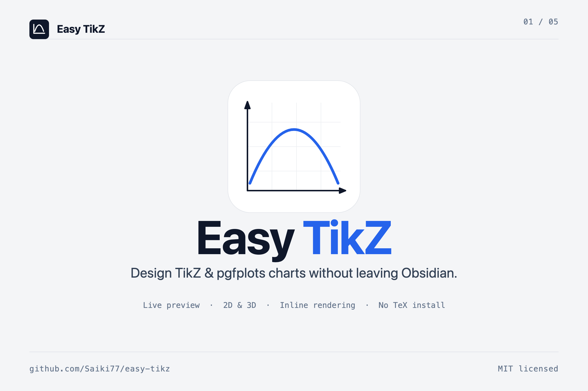
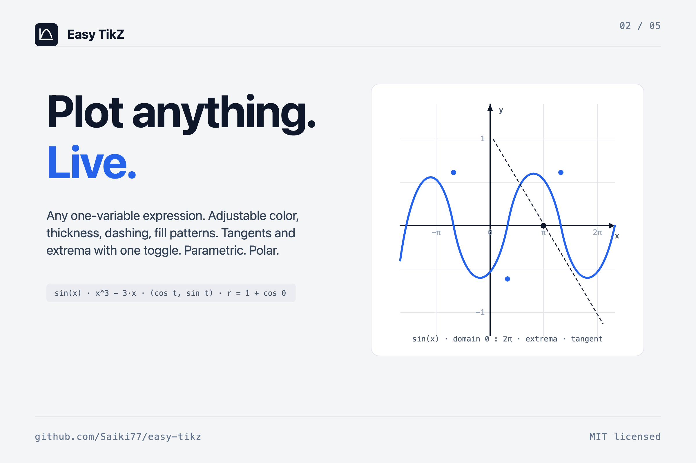
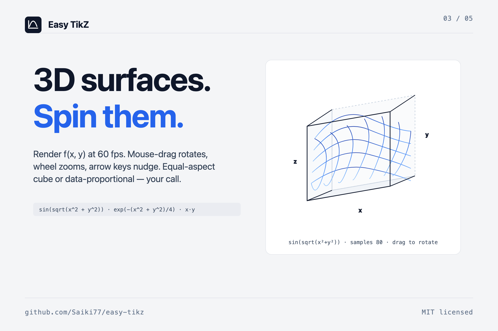
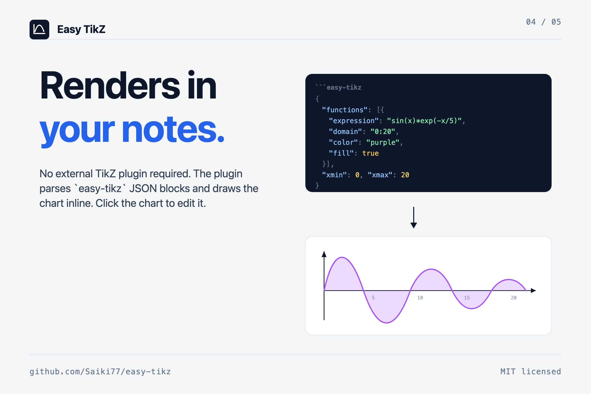
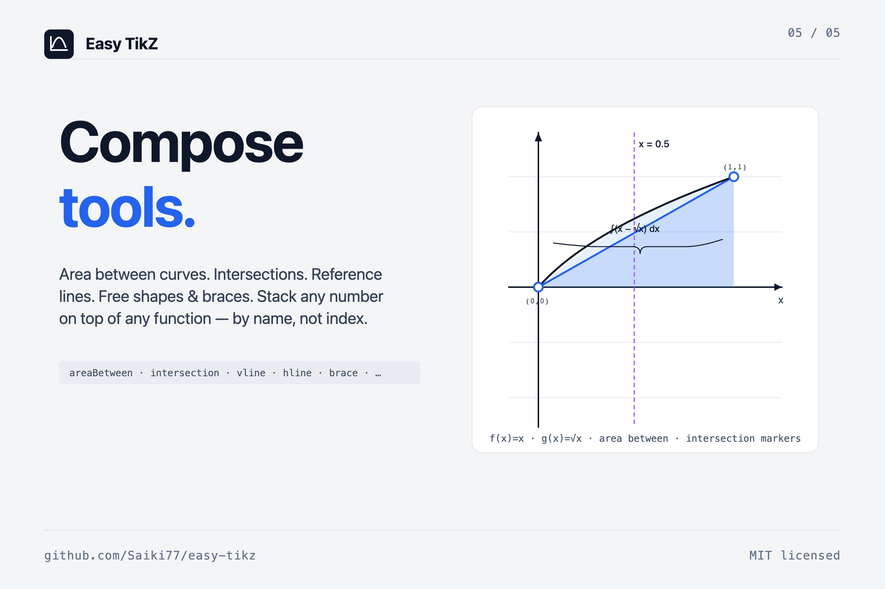

<p align="center">
  
</p>

<table>
  <tr>
    <td width="50%"></td>
    <td width="50%"></td>
  </tr>
  <tr>
    <td width="50%"></td>
    <td width="50%"></td>
  </tr>
</table>

## Why

Pgfplots is powerful but the syntax is fiddly and the feedback loop is "edit, recompile, squint". Easy TikZ is a visual editor with a live preview that renders the chart in your note directly — no TeX install needed for in-vault use, and the same model exports clean pgfplots when you want to publish.

## Install

**From inside Obsidian** (recommended)

1. Settings → Community plugins → **Browse**.
2. Search **Easy TikZ** and click **Install**, then **Enable**.

**Via BRAT** (early-access builds between releases)

1. Install the [BRAT](https://github.com/TfTHacker/obsidian42-brat) plugin.
2. BRAT settings → **Add Beta Plugin** → paste `Saiki77/easy-tikz`.
3. Enable **Easy TikZ** under Settings → Community plugins.

**Manual:** download `main.js`, `manifest.json`, `styles.css` from the [latest release](../../releases) into `<your vault>/.obsidian/plugins/easy-tikz/`.

**Migrating from 2.x.** The plugin id changed to `easy-tikz` in 3.0. Rename `.obsidian/plugins/tikz_graph_helper/` to `.obsidian/plugins/easy-tikz/`, then re-enable. Settings carry over.

## Quick start

1. Click the function icon in the ribbon (or run *Easy TikZ: open* from the palette).
2. Type an expression on the **Functions** tab — `sin(x)`, `x^2 - 3*x`, `sin(sqrt(x^2 + y^2))` in 3D. The preview updates as you type.
3. **Insert into note**. The plugin emits an `easy-tikz` code block which it renders inline.

Open an existing chart by clicking it in your note — the modal re-opens with every setting filled in, and saving replaces the source block in place.

## Plot

**2D.** Any one-variable expression. `^` is power, `Math.*` helpers are bare names, `PI` and `E` are constants. Toggle per-function: legend, fill (solid or pattern), dashed, tangent at a given x, automatic extrema markers, parametric (`x(t), y(t)`), or polar (`r(θ)`).

**3D.** Two-variable expressions over `(x, y)`. Wireframe or filled with adjustable opacity. Drag the preview to rotate, scroll to zoom, arrow keys for fine adjustments. Plugin setting controls the maximum samples-per-axis slider (default cap 80, raise up to 400 for export-quality surfaces).

```
sin(x)                       sin(x) * exp(-x/5)            r = 1 + cos(θ)
x^3 - 3*x                    1/(1 + x^2)                   (cos t, sin t)
sin(sqrt(x^2 + y^2))         exp(-(x^2 + y^2)/4)           x*y
```

The Reference tab inside the modal lists everything supported with examples.

## Tools

On top of your functions you can stack composable tools — these render alongside the curves in the preview and emit native pgfplots in the export:

| Tool             | What it draws                                                                              |
| ---------------- | ------------------------------------------------------------------------------------------ |
| `areaBetween`    | Filled region between two functions by **name** over an optional sub-domain.               |
| `intersection`   | Dots (and optional `(x, y)` labels) at every crossing of two functions on the visible range. |
| `verticalLine`   | Vertical reference at `x = c`, optional label near the top.                                |
| `horizontalLine` | Horizontal reference at `y = c`, same knobs.                                               |
| `rectangle`      | Free rectangle with stroke + optional fill pattern.                                        |
| `circle`         | Free circle by center and radius.                                                          |
| `segment`        | Line segment with arrow style `none / forward / backward / both`.                          |
| `brace`          | Curly brace between two points with optional centered label.                               |
| `plane3D`        | Slice plane at `axis = constant` in 3D, with chosen opacity.                               |
| `point3D`        | Marker at `(x, y, z)` with optional label.                                                 |
| `segment3D`      | 3D line between two points, optional arrow.                                                |

Function references use a **Name** field on each function card (auto-populated as `f1, f2, …`, user-editable). That means "area between `f` and `g`" is stable across edits even if you reorder the functions.

## Inline rendering in notes

The plugin registers an `easy-tikz` markdown code-block processor. **Insert into note** writes a JSON block; the same `SVGRenderer` / `SVG3DRenderer` that powers the modal preview renders the chart in your note. Click the rendered chart to re-open the modal pre-filled with every setting — change something, **Save changes**, the block in the source file is replaced in place.

Plugin setting **"Also render plain `tikz` blocks"** opts in to claim the `tikz` language tag as well; off by default to coexist peacefully with `obsidian-tikzjax` and similar.

## Export

`Copy TikZ code` produces standalone pgfplots that compiles with any TeX install — `\usepgfplotslibrary{fillbetween}` is injected automatically when an `areaBetween` tool is in use, the polar code path emits `axis equal`, `axis equal image` lights up when **Box aspect** is set to *Equal*. The inline render and the exported TikZ share one in-memory model, so what you see in the modal is what pgfplots draws — and the modal's `Copy SVG` and `Copy PNG` buttons each serialize the live scene with theme colours already resolved.

## Plugin settings

Settings → Community plugins → **Easy TikZ**:

- **Invert vertical drag in 3D.** Trackball convention by default (drag down tilts the scene up); flip for direct manipulation (camera follows finger).
- **Max 3D samples per axis.** Upper bound of the per-surface Samples slider. Default 80; can go up to 400 for export-quality meshes.
- **Also render plain `tikz` blocks.** Off by default; on if you want one tag for everything (conflicts with obsidian-tikzjax).
- **2D pan sensitivity.** Default 1.0 (direct: 1 mouse pixel = 1 chart pixel). 0.1–2.0.

## Live rendering, briefly

The preview is drawn in-process by a small custom pipeline — no shell-out, no LaTeX compile, no image round-trip — which is what lets the camera follow the cursor without lag. A typical 3D surface (samples=40, 1,600 quads) sits at ~60 fps; the slider's upper end (samples=120, 14,400 quads) settles above 30 fps. Sampled surface data is cached per-surface, keyed by expression + domain + sample count + z-range, so a pure camera change (rotation, zoom) re-projects from the cache without re-evaluating the function. Expression compilation is cached (LRU, 128 entries) so the 500 samples of a 2D curve compile their expression once per render, not once per sample.

## Permissions

- **Clipboard:** writes TikZ code / SVG / PNG on the *Copy …* buttons. No reads.
- **Active note:** inserts an `easy-tikz` block on **Insert into note**, replaces an existing block when saving from click-to-edit.
- **Network:** none.
- **Telemetry:** none.
- **Math evaluation:** user expressions are compiled with `Function` and evaluated in-renderer to draw the preview. Nothing is persisted or transmitted.

## Development

```bash
npm install
npm run dev    # watch mode
npm run build  # production build
```

```
src/
  modal.ts         # main modal UI + click-to-edit lifecycle
  renderer.ts      # 2D SVG renderer (functions + tools)
  renderer3d.ts    # 3D SVG / canvas renderer
  settings.ts      # state, serialisation, TikZ code generation
  math.ts          # expression evaluation, extrema, intersections
  colors.ts        # shared palette
  templates.ts     # built-in function templates + plugin data shape
  util.ts          # tick formatting, latex stripping
  styles.css       # all UI styling
  types.ts         # shared interfaces and the Tool union
```

## License

[MIT](LICENSE.md).
