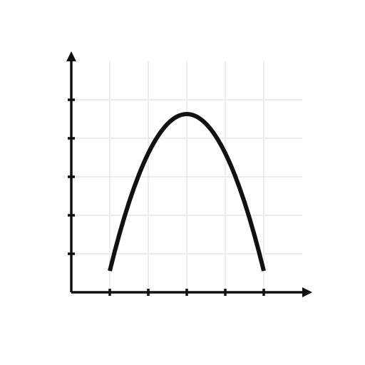
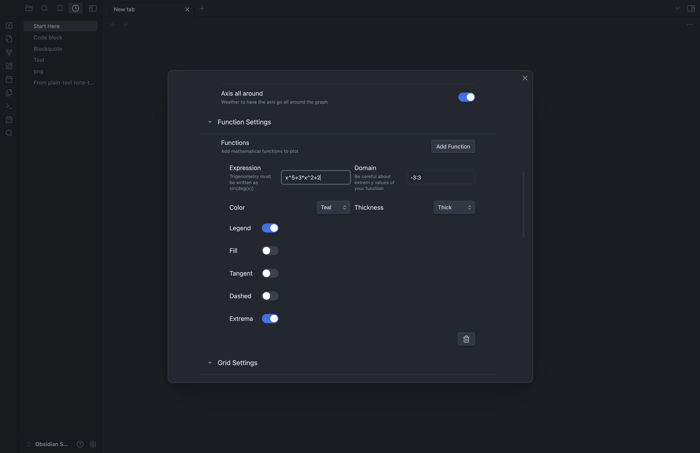
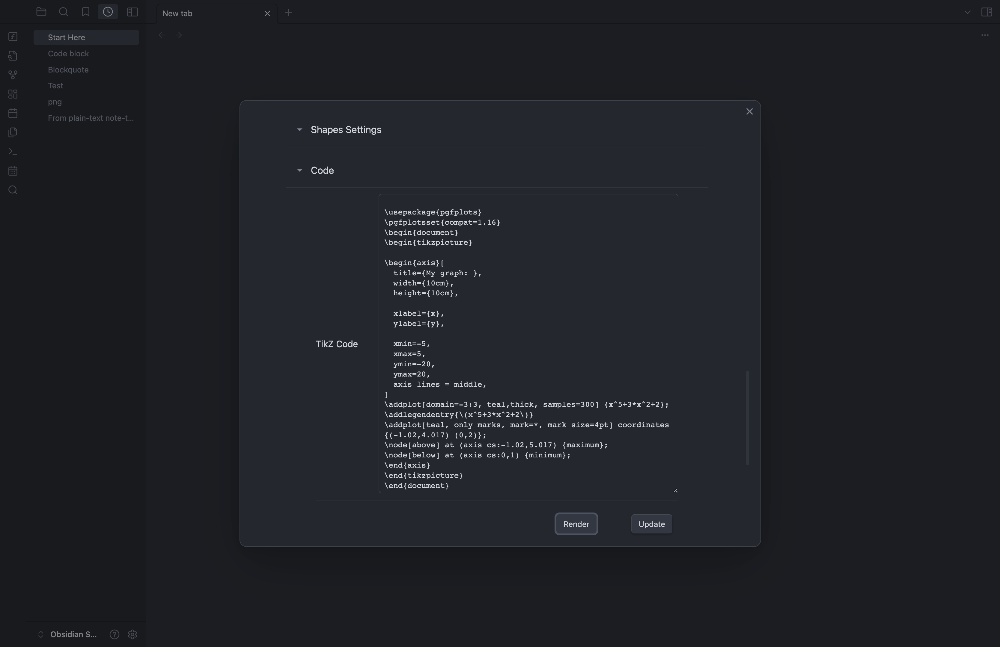
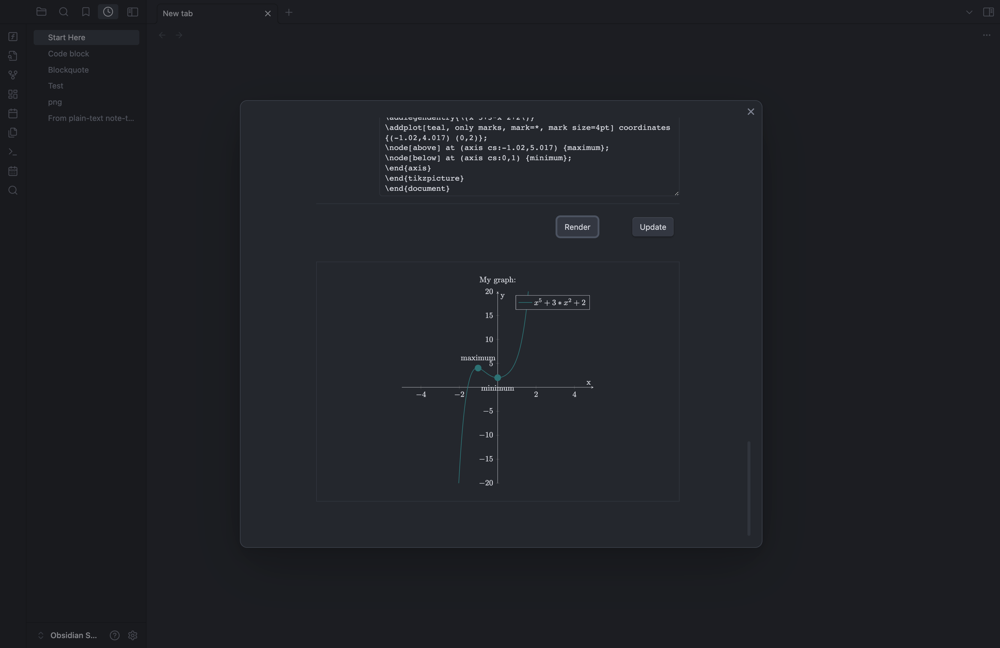

# Easy TikZ

<p align="center">
  
</p>

<p align="center">
  <strong>Visually design TikZ and pgfplots graphs in Obsidian with a live SVG preview.</strong>
</p>

<p align="center">
  
</p>

## Features

<table>
  <tr>
    <td width="50%" valign="top">
      <br>
      <strong>2D function plots.</strong> Plot any one-variable expression with customizable color, thickness, dashing, and fill. Tangent lines and automatic extrema detection are one toggle away.
    </td>
    <td width="50%" valign="top">
      <br>
      <strong>3D surface plots.</strong> Render f(x, y) surfaces with wireframe or filled mode, adjustable opacity, and interactive mouse-drag or arrow-key rotation.
    </td>
  </tr>
  <tr>
    <td width="50%" valign="top">
      <br>
      <strong>Live preview.</strong> Five tabs (Graph, Axis, Functions, Grid, Code) and a preview that updates as you type. Matches your Obsidian theme.
    </td>
    <td width="50%" valign="top">
      <br>
      <strong>One-click insertion.</strong> Copy the generated TikZ to the clipboard or insert it into the active note.
    </td>
  </tr>
</table>

## Why

Pgfplots is powerful but the syntax is fiddly and the feedback loop is "edit, recompile, squint". Easy TikZ is a visual editor with a live preview. Hit "Insert into note" when the plot looks right.

## Live rendering

The preview is drawn in-process by a small custom pipeline, not by pgfplots itself. There is no shell-out, no LaTeX compile, no image round-trip, which is what lets the camera follow the cursor without lag.

Rotation, drag, and wheel zoom are driven by `requestAnimationFrame`, so a typical surface (samples=40, 1,600 quads) sits at around 60 fps. Denser surfaces stay interactive too: a 6,400-quad surface (samples=80) hovers near 60 fps in canvas mode, and the slider's upper end (14,400 quads at samples=120) settles above 30 fps.

Two output paths share a single sample cache and a single depth sort:

- **SVG path.** Mutates a pool of pre-allocated `<polygon>` elements in place. The DOM at rest is queryable, so Copy SVG and Copy PNG serialise the live scene with theme colours resolved.
- **Canvas2D path.** Engaged during drag, scroll, and slider events. No DOM ops in the inner loop, hi-DPI aware via `devicePixelRatio`. 180 ms after the last interaction the renderer falls back to SVG so exports stay fresh.

Sampled surface data is cached per surface, keyed by expression, domain, sample count, and z-range. A pure camera change (rotation, view zoom) re-projects from the cache without re-evaluating the function. Expression compilation is cached too (LRU, 128 entries), so the 500 samples of a 2D curve or the 1,600+ vertices of a 3D surface compile their expression once per render, not once per sample.

The exported pgfplots code is independent: a real TeX engine produces the final figure. The preview exists to make the iteration loop tight.

## Installation

### Community plugins (recommended, once approved)

1. Open Obsidian Settings, Community plugins, Browse.
2. Search for "Easy TikZ".
3. Install and enable.

### BRAT (beta channel)

1. Install the [BRAT plugin](https://github.com/TfTHacker/obsidian42-brat).
2. Add `Saiki77/easy-tikz` as a beta plugin.
3. Enable the plugin in Obsidian Settings.

### Manual install

1. Download `main.js`, `manifest.json`, and `styles.css` from the [latest release](https://github.com/Saiki77/easy-tikz/releases).
2. Place them in `<vault>/.obsidian/plugins/easy-tikz/`.
3. Enable the plugin in Obsidian Settings.

### Migrating from 2.x

The plugin id changed to `easy-tikz` in 3.0. If you have a 2.x install:

1. Disable the plugin in Settings, Community plugins.
2. Rename `.obsidian/plugins/tikz_graph_helper/` to `.obsidian/plugins/easy-tikz/`.
3. Re-enable the plugin.

Settings carry over.

## Usage

1. Click the function icon in the ribbon, or run the command from the palette.
2. Configure your graph using the tabbed panel on the left:
   - **Graph:** title, dimensions, 2D or 3D mode, camera controls.
   - **Axis:** labels, ranges, axis style.
   - **Functions:** expressions, domains, styling, tangents, extrema.
   - **Grid:** major and minor grid lines.
   - **Code:** the generated TikZ output.
3. The live preview on the right updates as you edit.
4. In 3D mode, drag the preview to rotate, or focus it and use the arrow keys.
5. Click **Copy TikZ code** or **Insert into note** when done.

### Function syntax

Use `x` (2D) or `x` and `y` (3D). `^` is the power operator. All `Math.*` helpers are available as bare names, plus the constants `PI` and `E`.

- `x^2`, `x^3 - 3*x`, `1/(1 + x^2)`
- `sin(x)`, `cos(x)`, `tan(x)`, `tanh(x)`, `exp(x)`, `log(x)`, `sqrt(x)`
- Combinations: `sin(x) * exp(-x/5)`
- 3D: `sin(x) * cos(y)`, `x^2 + y^2`, `sin(sqrt(x^2 + y^2))`

The Reference tab inside the modal lists everything supported, with examples.

## Permissions

- **Clipboard:** writes TikZ code on "Copy TikZ code". No reads.
- **Active note:** inserts TikZ code on "Insert into note".
- **Network:** none.
- **Telemetry:** none.
- **Files:** no vault access outside the active note's insertion point.
- **Math evaluation:** expressions are compiled with `Function` and evaluated in-renderer to draw the preview. Not persisted, not transmitted.

## Development

```bash
npm install
npm run dev    # watch mode
npm run build  # production build
```

Source layout:

```
src/
  modal.ts         # main modal UI
  renderer.ts      # 2D SVG renderer
  renderer3d.ts    # 3D SVG renderer
  settings.ts      # state and TikZ code generation
  math.ts          # expression evaluation, derivatives, extrema
  colors.ts        # shared color palette
  util.ts          # shared rendering helpers (tick formatting, etc.)
  styles.css       # all dashboard styling
  types.ts         # shared interfaces
```

## License

[MIT](LICENSE.md).
