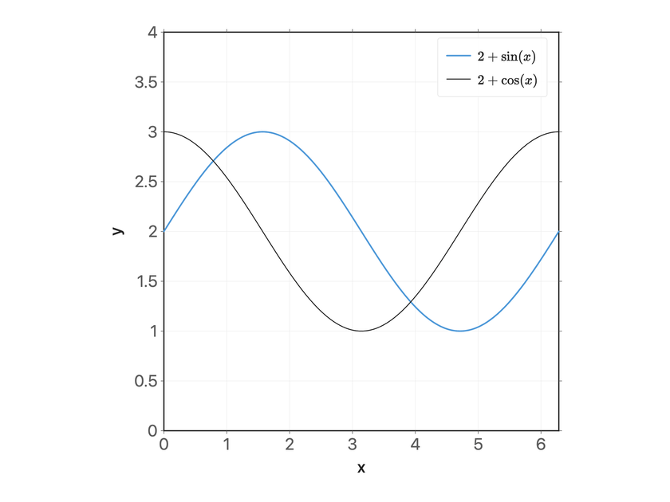
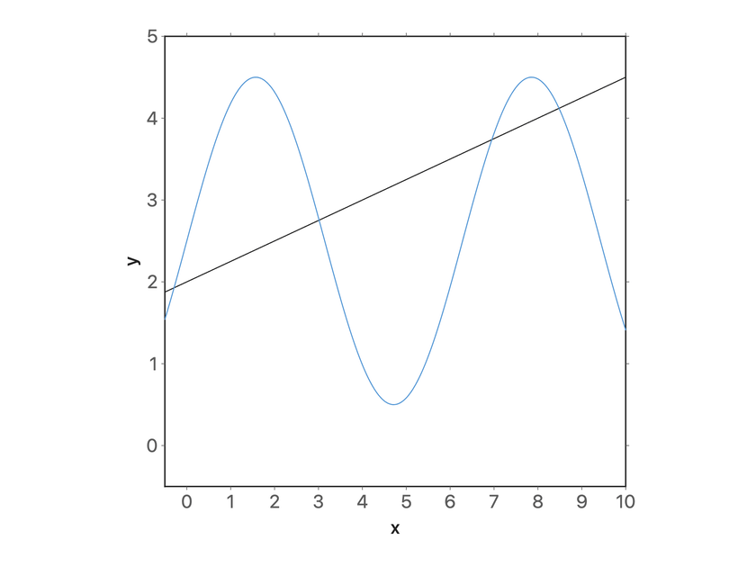
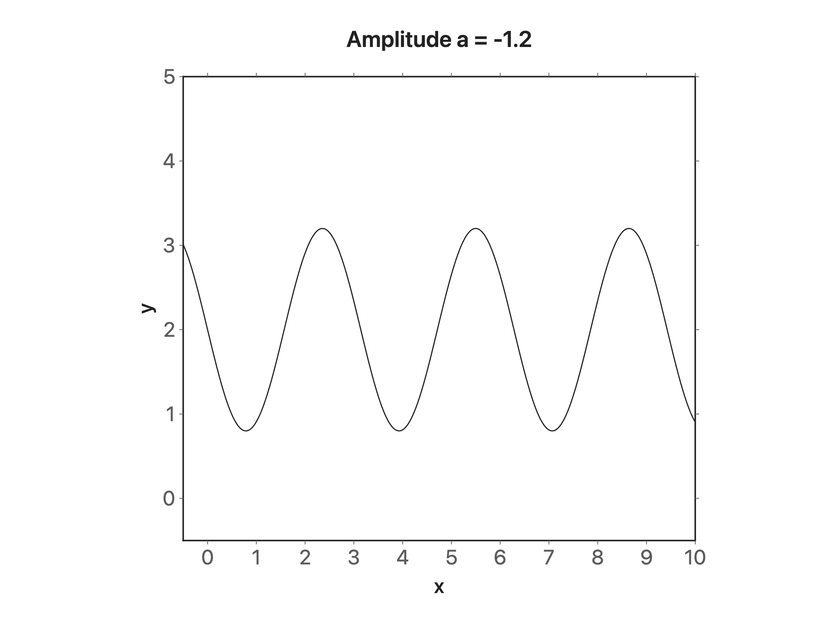
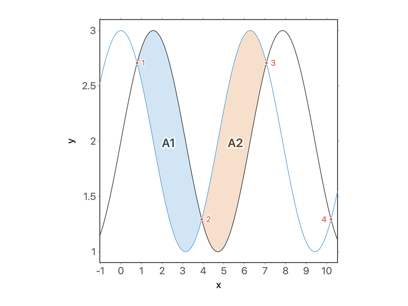
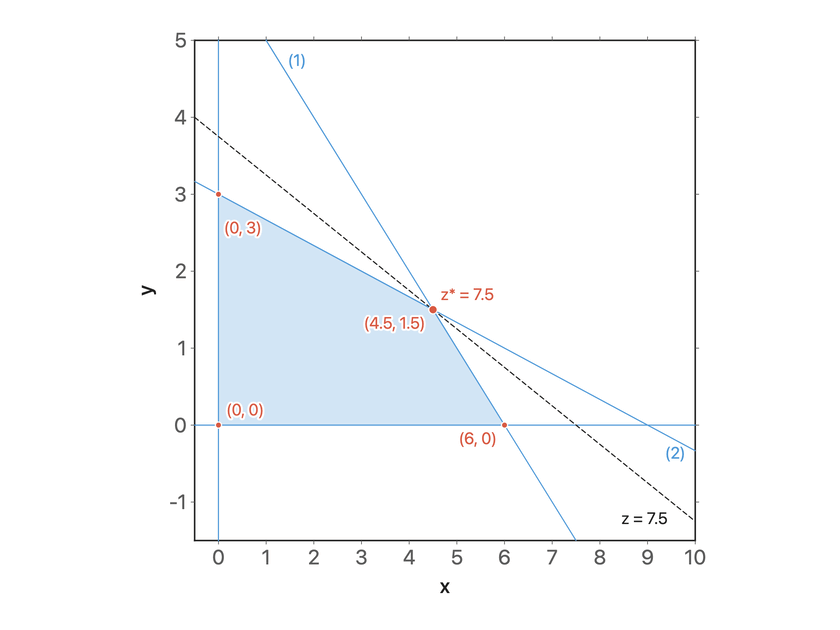
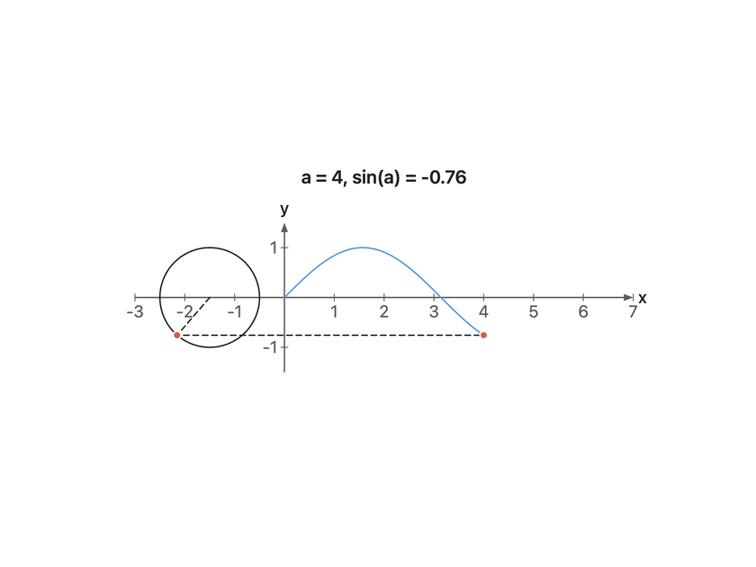
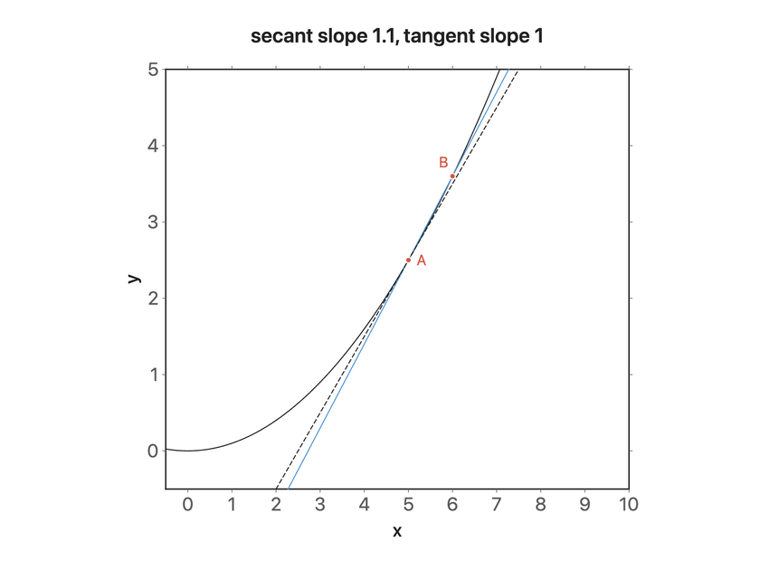
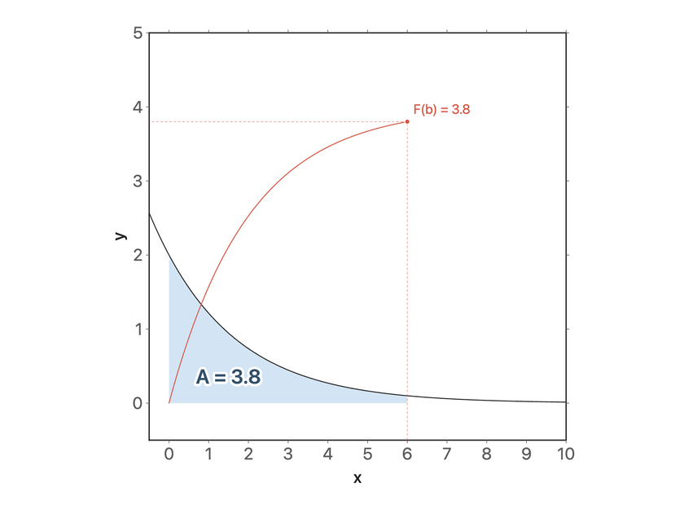
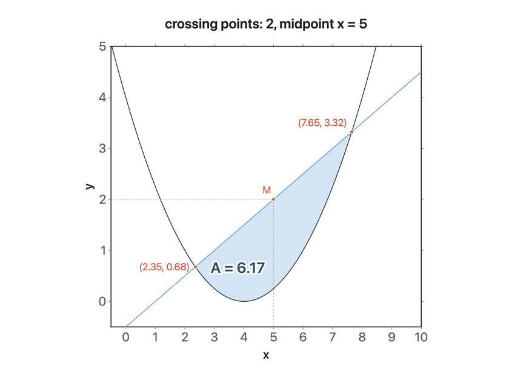

<p align="center">
  
</p>

<p align="center">
  <a href="docs/media/overview.mp4"></a>
</p>
<p align="center">Section 2 of the overview film as a loop: the Tangent explorer example, with the area between the curve and its tangent added (a hidden function f2 for the tangent and a region between the two). Drag the tangent point and tangent, slope and area follow; press play and it moves by itself. <a href="docs/media/overview.mp4">Watch the whole film</a> (40 s, MP4), whose first part is drag to edit on the Linear program example.</p>

**Easy TikZ** is an [Obsidian](https://obsidian.md) plugin for drawing TikZ and pgfplots charts without writing TikZ. You build a chart from formulas and cards, the preview redraws as you type, the chart renders in your note with no TeX install, and the Code tab holds pgfplots code that compiles with pdflatex.

<p align="center">
  <a href="#install">Install</a> ·
  <a href="#quick-start">Quick start</a> ·
  <a href="docs/guides/README.md">Guides</a> ·
  <a href="#what-is-new-in-version-4">What is new in 4</a> ·
  <a href="CHANGELOG.md">Changelog</a>
</p>

## What is new in version 4

**Drag to edit.** Grab a line, curve, point or label in the preview and the numbers in its formula follow the pointer. Hold Shift and a line turns about a point instead.

<p align="center">
  
</p>

<p align="center">
  <a href="docs/media/clip-drag.mp4"></a>
</p>
<p align="center">Drag the line and slider c follows. Hold Shift and it turns about the optimum, and its formula follows: 2x + 3y = c becomes 2.5x + 3y = c. <a href="docs/media/clip-drag.mp4">Watch the MP4</a> (19 s).</p>

**Also in version 4**

- **Live sliders.** Any number can be a slider: in formulas, conditions, labels and axis ranges. Drag one or press play, and the picture follows while it moves. [Sliders and live values](#sliders-and-live-values)
- **Live calculations.** Points publish their results (`P1_x`, `P1_val`, `P1_n`), and any formula or label can use them: `z* = {P1_val:2}`.
- **Five general tools, not eleven.** Regions from inequalities, curves from equations, points (intersections, corners, the optimum, integer points), segments and 3D planes. [Tools](#tools)
- **Charts in your notes keep their sliders.** Moving them never changes the note. [Inline rendering](#inline-rendering-in-notes)
- **A redesigned editor.** Four tabs, one card per object, problems shown under their field (often with a one-click fix), undo, and a draft that survives closing. [Quick start](#quick-start)
- **LaTeX that compiles.** A standalone document by default, in the colours and layers of the preview. [Export](#export)
- **Guides in the Help tab.** 24 step-by-step guides with live charts, and the same guides with screenshots on GitHub. [Guides](#guides)
- **Charts from 3.x keep working.** They are converted when they render or open, and a note is only rewritten when you press **Save changes**. The guide [Coming from 3.x](docs/guides/from-3x.md) shows where the eight old tabs went.

**New in 4.2**

- **A "What's new" popup.** After you update from 3.x or an earlier 4.x, Easy TikZ shows once what version 4 brings, with a live chart whose slider you can drag or play (the area between x^3 - 3x and its tangent) and buttons to try it in the editor or open the guides. A new install never shows it. Open it again with the command **Show what's new in version 4** or the link **What's new in version 4** in the Help tab, or switch it off with the setting **Show what's new after updates**.
- **Four guides on live calculations and sliders:** [Animate a chart with play](docs/guides/animate-play.md), [From secant to tangent](docs/guides/secant-tangent.md), [An area that grows with a slider](docs/guides/area-accumulation.md) and [Calculate with computed points](docs/guides/computed-values.md).

Every picture and film on this page shows the plugin running in Obsidian, moved by real mouse and keyboard input. The graph paper, the notes and the arrows around the captures are added afterwards. The scripts that make them are in [`scripts/media`](scripts/media/README.md).

## Why

Pgfplots is powerful but the syntax is fiddly and the feedback loop is "edit, recompile, squint". Easy TikZ is a visual editor with a live preview that renders the chart in your note directly (no TeX install needed for in-vault use), and the same model exports clean pgfplots when you want to publish.

Version 4 adds sliders that move the picture while you drag them, drag to edit (grab a line, curve or point in the preview and its numbers follow), and a handful of general tools (regions from inequalities, curves from equations, computed points) that cover lecture-style pictures: several areas between curves, linear programs with their optimum, level curves touching a constraint, market equilibria.

## Install

Easy TikZ needs Obsidian 1.13 or newer and runs on desktop only.

**From inside Obsidian** (recommended)

1. Settings → Community plugins → **Browse**.
2. Search **Easy TikZ** and click **Install**, then **Enable**.

**Via BRAT** (early-access builds between releases)

1. Install the [BRAT](https://github.com/TfTHacker/obsidian42-brat) plugin.
2. BRAT settings → **Add Beta Plugin** → paste `Saiki77/easy-tikz`.
3. Enable **Easy TikZ** under Settings → Community plugins.

**Manual:** download `main.js`, `manifest.json`, `styles.css` from the [latest release](https://github.com/Saiki77/easy-tikz/releases/latest) into `<your vault>/.obsidian/plugins/easy-tikz/`.

**Upgrading from 3.x.** Existing `easy-tikz` blocks keep working: they are migrated in memory when they render or open, and the note is only rewritten when you press **Save changes** in the editor. After the update a short **What's new** popup shows once what changed. See the guide [Coming from 3.x](docs/guides/from-3x.md) for where everything went and the [CHANGELOG](CHANGELOG.md) for what migration does.

**Migrating from 2.x.** The plugin id changed to `easy-tikz` in 3.0. Rename `.obsidian/plugins/tikz_graph_helper/` to `.obsidian/plugins/easy-tikz/`, then re-enable. Settings carry over.

## Quick start

1. Click the function icon in the ribbon (or run *Easy TikZ: Open editor* from the command palette).
2. The **Build** tab opens on "Start a chart". Type a formula such as `x^2 - 2x` and press Enter, or pick one of the six examples below the field.
3. Use **+ Add** for everything else: more functions, shaded regions, lines and curves, points, arrows, braces, text labels and sliders. The preview redraws as you type.
4. Adjust by hand: drag a line, curve, point or label in the preview and its numbers change so it follows the pointer; Shift-drag turns lines and stretches curves (see [Drag to edit](#drag-to-edit)). Drag empty space to pan, scroll to zoom.
5. **Insert into note** (Cmd/Ctrl+Enter). The plugin writes an `easy-tikz` code block and renders it inline.

Click a chart in your note to edit it again: the editor opens with every setting filled in, and **Save changes** replaces the block in place.

The editor has four tabs:

| Tab       | What is there                                                                                              |
| --------- | ---------------------------------------------------------------------------------------------------------- |
| **Build** | Everything you draw, as cards: functions (or surfaces in 3D), then shapes, points and labels.              |
| **Chart** | Ranges (formulas allowed), axes, axis variables, equal scale, grid, export size, note width, 3D view.      |
| **Code**  | The LaTeX, with a **Standalone document** switch. Hand edits are kept until you press Regenerate.          |
| **Help**  | Step-by-step [guides](#guides) with live charts, the full reference with **Open example** buttons, and a link to What's new. |

Under the preview sits the **Sliders** dock (visible in every tab). The header switches between 2D / 3D and Cartesian / Polar; its "more" menu opens the examples and your saved templates.

Problems show under their field after a short pause, often with a one-click fix (**Add slider k**, **Use a\*x**, **Use sin**), and a status chip on the preview lists them all. A chart with an error still draws everything else. Deleting a card or finishing a drag shows an **Undo** bar, Cmd/Ctrl+Z and Cmd/Ctrl+Shift+Z undo and redo outside text fields, and a chart you close without inserting is kept as a draft that the editor offers to restore.

## Guides

24 step-by-step guides (171 steps) take you from the first formula to integer programs, live calculations and LaTeX export. They come from one source and exist in two places:

- **In the editor:** the **Help** tab. Search or pick a guide; every step shows a live chart and has a button **Open this step in the editor**, and the things to type are rows with a **Copy** button.
- **On GitHub:** [docs/guides](docs/guides/README.md). The same steps with 166 screenshots of the plugin in Obsidian, one for nearly every step, and every guide ends with its finished chart as a block to paste into a note.

Five to start with:

| Finished chart | Guide |
| --- | --- |
| <a href="docs/guides/first-chart.md"></a> | **[Your first chart](docs/guides/first-chart.md)**<br>From an empty editor to a chart in your note: type a formula, style it, set the ranges and insert it.<br>Start here · 5 min · 8 steps |
| <a href="docs/guides/drag-to-edit.md"></a> | **[Drag shapes to edit them](docs/guides/drag-to-edit.md)**<br>Grab a line or a curve in the preview and its numbers follow: move, turn, stretch, undo.<br>Start here · 7 min · 8 steps |
| <a href="docs/guides/sliders.md"></a> | **[Sliders that move the picture](docs/guides/sliders.md)**<br>Turn a letter in a formula into a slider, set its range, play it and print its value in the chart.<br>Core · 6 min · 7 steps |
| <a href="docs/guides/areas-between.md"></a> | **[Shade the areas between two curves](docs/guides/areas-between.md)**<br>Two curves, the areas between them in two colours, and their crossing points as the limits of the shading.<br>Core · 7 min · 7 steps |
| <a href="docs/guides/linear-program.md"></a> | **[Solve a linear program in a picture](docs/guides/linear-program.md)**<br>Feasible region, labelled constraint lines, an objective line on a slider, the optimum, the corners, and a sensitivity test by dragging.<br>Core · 10 min · 8 steps |

New in 4.2, four guides on live calculations and sliders:

| Finished chart | Guide |
| --- | --- |
| <a href="docs/guides/animate-play.md"></a> | **[Animate a chart with play](docs/guides/animate-play.md)**<br>A point runs around the unit circle while the sine curve draws itself behind it: one slider in points, a domain, a path and the title, then press play.<br>Core · 8 min · 7 steps |
| <a href="docs/guides/secant-tangent.md"></a> | **[From secant to tangent](docs/guides/secant-tangent.md)**<br>Draw the secant through two points of a curve, shrink their distance h with a slider and watch its slope approach the slope of the tangent.<br>Core · 9 min · 8 steps |
| <a href="docs/guides/area-accumulation.md"></a> | **[An area that grows with a slider](docs/guides/area-accumulation.md)**<br>Shade the area under a curve from 0 to a slider b, print its size, and draw the function that adds it up, so the height of one curve shows the area under the other.<br>Core · 8 min · 7 steps |
| <a href="docs/guides/computed-values.md"></a> | **[Calculate with computed points](docs/guides/computed-values.md)**<br>Crossing points publish their coordinates and their count: use them in the title, in a new point and in an area formula, and see what they do while a slider plays.<br>Core · 9 min · 7 steps |

All guides by topic: [Getting started](docs/guides/README.md#getting-started), [Functions and sliders](docs/guides/README.md#functions-and-sliders), [Regions and optimisation](docs/guides/README.md#regions-and-optimisation), [Points, lines and labels](docs/guides/README.md#points-lines-and-labels), [3D](docs/guides/README.md#3d), [Notes and export](docs/guides/README.md#notes-and-export) and [Reference](docs/guides/README.md#reference) (coming from 3.x, shortcuts and troubleshooting).

## Plot

**2D.** Any formula in x. `^` is power, `sin`, `exp`, `ln`, `sqrt`, ... are bare names, `pi` and `e` are constants (`PI`, `E` and `Math.*` still work). You can leave out `*`: `2x`, `3(x + 1)`, `a x + b`. Each function card has a name (`f1`, `f2`, ...) that other formulas use: `f1(x - 1)`, `2 f1 + 1`, `f2 <= y <= f1`. Per function: legend (your own text or the formula typeset), fill to the x-axis (solid or pattern), dashed, thickness, tangent at a number, a slider or `min` / `max`, automatic extrema markers, parametric (`x(t), y(t)`), or polar (`r(θ)`) via the header switch. Drag empty space in the preview to pan (hold Space or use the middle mouse button to pan from on top of a shape) and scroll to zoom; the lock button switches both off, and axes whose bounds are formulas (`2a`) are left alone. A drag that starts on a shape edits it: see [Drag to edit](#drag-to-edit).

**3D.** Formulas in x and y. Wireframe or filled with adjustable opacity, planes, points, arrows and labels with a z position. Drag the preview to rotate (arrow keys for fine steps when it has focus) and use the zoom buttons in its corner. A plugin setting controls the maximum samples-per-axis slider (default cap 80, up to 120).

```
sin(x)                       sin(x) exp(-x/5)              r = 1 + cos(θ)
x^3 - 3x                     1/(1 + x^2)                   (cos(t), sin(t))
sin(sqrt(x^2 + y^2))         exp(-(x^2 + y^2)/4)           x y
```

Two traps: `ax` is one name (write `a x` or `a*x`; the error offers **Use a\*x**), and `1/2x` is `(1/2)*x`. The Help tab lists every operator and function. For models in other letters, set **Axis variables** in Chart > Axes to `x1, x2` or `q, p`.

Guides: [Write formulas that work](docs/guides/formulas.md), [Tangents and extrema](docs/guides/tangents-extrema.md), [Parametric and polar curves](docs/guides/parametric-polar.md), [Surfaces, planes and points in 3D](docs/guides/surfaces-3d.md).

## Tools

Version 4 replaces the eleven special-purpose tools of 3.x with five general ones. Everything you can type in them is a formula, so sliders and computed values work in every field.

| Tool        | What it covers                                                                                                                                                                                                                                                         |
| ----------- | ---------------------------------------------------------------------------------------------------------------------------------------------------------------------------------------------------------------------------------------------------------------------- |
| **Region**  | Shades where every condition holds, one condition per row: `x + y <= 4`, `0 <= x <= 2pi`, `f2 <= y <= f1`, `(x - 3)^2 + (y - 2)^2 <= 4`, `x <= 1 or x >= 3`. Areas between any number of curves, areas under a curve, feasible regions, rectangles, disks, unions. Fill, pattern, outline, a label, and **Constraint lines** that draw each condition's boundary across the view with its own label (`(1)`, `labour`). |
| **Curve**   | An equation in x and y: `2x + 3y = 12`, `x = 2`, `(x - 3)^2 + (y - 2)^2 = 4`, `x y = 4`. With **Levels** (`2, 4, c, P1_val`) it draws the level curves of a formula: indifference curves, iso-profit lines, contour plots.                                                    |
| **Points**  | Marks a list of points, the intersections of two functions or curves, the corners of a region, or the integer points inside a region. An optional objective (`2x + 3y`, Max / Min) keeps only the best: the continuous optimum over a region, the best integer point, the best listed point. Labels, drop lines to the axes. In 3D: a list of `(x, y, z)` points. |
| **Segment** | A path through two or more points (`(0, 0); (3, 2)`, or a points tool's name): line, arrow forward / backward / both, closed polygon, or a curly brace with a label. 2D and 3D (braces in 2D only).                                                                                 |
| **Plane**   | 3D only: the plane x, y or z = value (sliders allowed), sorted in depth with the surfaces it cuts.                                                                                                                                                                     |

Text labels sit at a position such as `(P1_x, P1_y + 0.3)` and can be dragged in the preview: plain numbers change, and a position written as a formula gets an offset (`P1_x + 0.4`).

You rarely pick a tool directly: **+ Add** lists recipes in plain words (Area between two functions, Feasible region, Vertical line x = c, Intersections of two functions, Optimum over a region, Integer points in a region, Brace with label, ...), and each of these is a pre-filled card of one of the five tools (the list also adds functions, text labels and sliders). 3.x blocks are converted on open: `areaBetween` and `rectangle` become regions, `verticalLine`, `horizontalLine` and `circle` become curves (a filled circle becomes a region), `intersection` and `point3D` become points, `segment`, `brace` and `segment3D` become segments, and `plane3D` stays a plane.

Names are stable: functions are `f1, f2, ...`, tools `R1, C1, P1, S1, PL1, ...`, all renameable on the card, and a rename updates every formula and label placeholder that uses the name.

Guides: [Shade a region with inequalities](docs/guides/regions.md), [Shade the areas between two curves](docs/guides/areas-between.md), [Shade between a curve and its tangent](docs/guides/tangent-area.md), [Points, intersections and live labels](docs/guides/points-labels.md), [Segments, arrows and braces](docs/guides/arrows-braces.md), [Calculate with computed points](docs/guides/computed-values.md).

## Sliders and live values

A slider is a named number you can use anywhere: in formulas, domains, region conditions, point lists, labels and axis ranges (`xmax = 2a`).

- **Create one** with **Add slider** in the dock, with + Add > Slider, or with the **Add slider k** fix that appears under any field using an unknown name.
- **Drag it and the picture follows while you drag**: the preview redraws on the next animation frame, then once more at full quality 150 ms after you stop. Expressions are compiled once and read slider values at call time, and each tool is recomputed only when a slider it uses changes.
- **Play** sweeps a slider between its minimum and maximum. Type a value outside the range and the range widens.
- **Computed values.** Every points tool publishes its results under its name: `P1_x`, `P1_y` (`P1_z` in 3D), `P1_val` (objective value), `P1_n` (count), and `P1_x2`, `P1_y2`, ... for later points. Any field can use them, and they update live: a line `2x + 3y = P1_val` through the optimum, a region bounded by `P1_y`, a tangent at `P1_x`.
- **Label templates.** Every text (title, text labels, region, condition, curve, point and segment labels) can show values: `{c}` (up to 3 decimals), `{P1_val:1}` (1 decimal). Points add `{x}`, `{y}`, `{z}`, `{val}` and `{i}`; curves add `{level}`. `$...$` is LaTeX math.
- **In your notes** the chart shows its sliders underneath (up to three rows, then "Show N more", plus a reset button). Moving them changes the picture for the current session only and never edits the note. Switch them off in Chart > In your note.

Guides: [Sliders that move the picture](docs/guides/sliders.md), [Animate a chart with play](docs/guides/animate-play.md), [From secant to tangent](docs/guides/secant-tangent.md), [An area that grows with a slider](docs/guides/area-accumulation.md), [Calculate with computed points](docs/guides/computed-values.md).

## Drag to edit

In the editor's 2D preview, drag a line, curve, point or text label, and Easy TikZ rewrites the numbers in its formula so that the part you grabbed follows the pointer. Only numbers and their signs are rewritten (your spacing, `*` and `≤` stay as typed), and the card and the Sliders dock update while you drag. The film under [What is new in version 4](#what-is-new-in-version-4) shows a drag and a Shift-turn on the Linear program example.

| Gesture                   | What it does                                                                                                         |
| ------------------------- | -------------------------------------------------------------------------------------------------------------------- |
| Drag                      | Moves the shape.                                                                                                     |
| Shift-drag                | Turns a straight line, stretches a curve, resizes a circle, each around the ⊕ mark. Points and labels move straight. |
| Alt (Option) held         | Fine control: no snapping, no rounding to rounder numbers.                                                           |
| Click, then arrow keys    | Moves the selected shape by about a tenth of a grid step (Shift: ten times, Alt: a tenth). Enter opens its field.    |
| Space-drag, middle button | Pans, also from on top of a shape.                                                                                   |

- **Which numbers change:** sliders first, then the numbers you typed, and only if needed an inserted shift, offset or factor. A constant exponent (the `2` in `x^2`) never changes. Rest the pointer on a shape and a tip shows in advance what will change.
- **Examples:** dragging `sin(x)` by 0.5 to the right and 0.5 up gives `sin(x - 0.5) + 0.5`. Shift-dragging the constraint `x + 3y <= 6` from (0, 2) to (0, 2.5) turns it around the corner (3, 1) into `x + 2y <= 5`. Dragging `2x + 3y = c` leaves the text alone and moves the slider `c`.
- **You can grab** functions y = f(x), region edges and constraint lines, curve tool lines, circles and level curves, listed points, segments and their ends, and text labels. Computed points (optimum, corners, intersections, integer points) stay computed: drag the lines that define them. A press on one goes through to the line under it.
- **Snapping:** moved shapes snap to markers and the origin, lines snap through nearby markers, points, segment ends, labels and the vertex of a graph snap to the major grid, and turns click into simple slopes.
- **Undo:** Esc cancels a running drag. Each finished drag is one step in the Undo bar and under Cmd/Ctrl+Z (redo: Cmd/Ctrl+Shift+Z), in one history with deletes and slider changes. After a drag that changed one typed number, **Make slider** turns that number into a slider.
- **Switch:** the pointer button **Edit shapes by dragging** in the preview's action pill turns it off, and the preview then pans wherever you drag (text labels still move). Not draggable yet: parametric and polar curves, the inside of a region, 3D charts and charts in notes.

Guide: [Drag shapes to edit them](docs/guides/drag-to-edit.md). Every key and mouse gesture is in [Keyboard, mouse and troubleshooting](docs/guides/shortcuts.md).

## Optimisation diagrams

A linear program with its feasible region, an objective line on a slider and the optimum, built in the editor:

1. **+ Add > Feasible region (inequalities).** It starts with `x >= 0`, `y >= 0` and constraint lines on. Type `x + y <= 4` in the empty row and add a row `x + 3y <= 6`; **Number them** labels the constraint lines (1), (2), ...
2. **+ Add > Line from an equation**, type `2x + 3y = c` and click **Add slider c** under the field. Set the curve label to `z = {c}`.
3. On the region card, **Find optimum**: a points tool over the region with the objective `2x + 3y`, Max. **Mark corners** adds the vertices with their coordinates.
4. In Chart > Ranges, set x from 0 to 5 and y from 0 to 4.5. Press play on `c` and watch the line sweep across the region: the last point it touches is the optimum (3, 1), at c = 9.

The same chart as a block you can paste into a note:

````
```easy-tikz
{
  "v": 4,
  "xmin": "0", "xmax": "5", "ymin": "0", "ymax": "4.5",
  "axis_style": "axes",
  "parameters": [{ "name": "c", "value": 6, "min": 0, "max": 15, "step": 0.1 }],
  "tools": [
    { "type": "region", "name": "R1", "color": "blue",
      "conditions": ["x + y <= 4", "x + 3y <= 6", "x >= 0", "y >= 0"],
      "conditionLabels": ["(1)", "(2)", "", ""], "constraintLines": true },
    { "type": "curve", "name": "C1", "color": "red", "dashed": true,
      "equation": "2x + 3y = c", "label": "z = {c}" },
    { "type": "points", "name": "P1", "color": "red", "size": "large",
      "source": "region", "regionName": "R1", "objective": "2x + 3y", "sense": "max",
      "label": "z* = {val} at ({x}, {y})" }
  ]
}
```
````

Missing fields take their defaults, and the editor fills them in when you save. From here:

- **Pin the line to the optimum** with `2x + 3y = P1_val` instead of the slider.
- **Drag instead of typing:** grab a constraint line in the preview, and the region, its corners and the optimum follow. Shift-drag the objective line to turn it: the objective of P1 changes with it, because both are the same text.
- **Sensitivity:** replace a right-hand side with a slider (`x + y <= b`) and press play. Region, corners and optimum follow.
- **Integer programs:** a points tool with source Integers over R1 and the same objective marks the best integer point.
- **Nonlinear objectives:** draw the objective as a curve with levels (`x^2 + y^2` at `1, 3.2, 6`), shade the constraint as a region, find the minimum with a points tool over it (Min), and add a curve `x^2 + y^2` with levels `P1_val`: the level curve that touches the constraint at the optimum.
- **Unbounded or infeasible:** the status chip says when the objective is unbounded within the view or the region is empty.

Four guides build such charts step by step: [Solve a linear program in a picture](docs/guides/linear-program.md), [Compare an integer program with its relaxation](docs/guides/integer-program.md), [Find a nonlinear optimum with level curves](docs/guides/level-curves.md) and [Draw a market with surplus areas](docs/guides/supply-demand.md). The reference in the Help tab has a section *Optimisation recipes*, and the examples *Linear program*, *Level curves and a constraint* and *Market equilibrium* open them ready-made.

## Inline rendering in notes

The plugin registers an `easy-tikz` markdown code-block processor. **Insert into note** writes a JSON block; the same renderers that power the editor preview draw the chart in your note, and a chart with sliders gets its own slider strip underneath. Click the rendered chart to re-open the editor pre-filled with every setting: change something, **Save changes**, and the block in the source file is replaced in place. Hover the chart for alignment and width controls. If something in the chart cannot be drawn, a muted line under the chart names the problem; the rest of the chart still renders.

Guide: [Charts in your notes](docs/guides/charts-in-notes.md).

Plugin setting **"Also render plain `tikz` blocks"** opts in to claim the `tikz` language tag as well; off by default to coexist peacefully with `obsidian-tikzjax` and similar.

## Export

**Copy TikZ** (and the Code tab) produces pgfplots code that compiles with pdflatex. By default it is a standalone document (`\documentclass[border=5pt]{standalone}` plus the packages it needs); switch off **Standalone document** in the Code tab to get only the `tikzpicture`, with `% Needs: ...` lines listing what your preamble must load.

The preview and the export draw the same scene, so what you see is what pgfplots draws:

- **Functions** are exported as formulas (`\addplot`), with slider values substituted, functions used by name written out, and trigonometry in radians (`trig format plots=rad`). Curves are split where the preview breaks them (poles, jumps), and `restrict ... to domain` with `unbounded coords=jump` keeps steep functions such as `x^3` or `tan(x)` from stopping pdflatex with "Dimension too large".
- **Regions, curves, points, segments and braces** are computed by the plugin and exported as coordinates. They match the preview exactly, but they do not recompute if you edit the LaTeX. The export is a snapshot at the current slider values.
- **Colours** are defined with `\definecolor` inside the picture, so the PDF uses the preview's colours rather than xcolor's (whose `green`, `purple` or `teal` look quite different). "Auto" (the theme's text colour) exports as black.
- **Layers and legend:** fills sit on the axis background layer, below axes, curves and markers. Every `\addplot` without a legend entry (markers, extra pieces of a broken curve) carries `forget plot`, so legend entries stay with their functions.
- **Text:** labels are escaped, so `50% cut`, `x_1` or `R&D` print as typed, while `$...$` math and LaTeX commands such as `\textbf{A}` pass through.
- **Size and aspect:** width and height come from Chart > Export size; **Equal scale** (always on in polar charts) exports as `axis equal image`, which keeps your ranges and shrinks the box.

The editor's **Copy SVG** and **Copy PNG** buttons serialize the live preview with theme colours already resolved.

Guide: [Export to LaTeX](docs/guides/export-latex.md) (standalone document or snippet, the size on paper, colours and label text, what the export freezes, hand edits).

## Plugin settings

Settings → Community plugins → **Easy TikZ**:

- **Invert vertical drag in 3D.** Trackball convention by default (drag down tilts the scene up); flip for direct manipulation (camera follows finger).
- **Max 3D samples per axis.** Upper bound of the per-surface Samples slider. Default 80, at most 120. The export always uses at most 60 samples per axis, because pdflatex runs out of memory above that.
- **2D pan sensitivity.** Default 1.0 (direct: 1 mouse pixel = 1 chart pixel), from 0.1 to 2.0.
- **Also render plain `tikz` blocks.** Off by default; on if you want one tag for everything (conflicts with obsidian-tikzjax).
- **Show what's new after updates.** On by default. After an update that brings something new, a short popup shows what changed, once. The command **Show what's new in version 4** and the link in the Help tab open it at any time.

## Live rendering, briefly

The preview is drawn in-process by a small custom pipeline (no shell-out, no LaTeX compile, no image round-trip), which is what lets sliders and the camera follow the cursor without lag. Expressions are parsed once and compiled into plain closures (no `eval`, no `Function`); sliders are read when the closure runs, so dragging one never recompiles anything. Regions, curves and points are memoised per tool and keyed by the sliders and names they use: dragging the objective slider `c` recomputes the objective line, not the feasible region. While a slider moves, the 2D preview draws at draft resolution on every animation frame and redraws at full quality once you stop. Drag to edit rides on the same loop: each pointer event solves for the new numbers, rewrites the text and requests a draft frame.

A typical 3D surface (samples=40, 1,600 quads) sits at ~60 fps; the slider's upper end (samples=120, 14,400 quads) settles above 30 fps. Sampled surface data is cached per surface, keyed by expression, domain, sample count, z-range and the sliders the surface uses, so a pure camera change (rotation, zoom) re-projects from the cache without re-evaluating the function.

## Permissions

- **Clipboard:** writes TikZ code / SVG / PNG on the *Copy …* buttons, and the text of a "type" row when you press **Copy** in a guide. No reads.
- **Active note:** inserts an `easy-tikz` block on **Insert into note**, replaces an existing block when saving from click-to-edit, and updates `displayWidth` / `displayAlign` when you use a chart's width or alignment controls. Inline sliders never write to the note.
- **Plugin data:** the plugin settings above, your saved function templates, the state of the **Edit shapes by dragging** switch (and that its first-use tip was shown), which version of the What's new popup was shown and, while the editor is open, an autosaved draft of the chart (cleared when you insert or save).
- **Your notes, read only:** when the plugin starts without any stored data and What's new is switched on, it looks through your notes for an `easy-tikz` block and stops at the first one. A 3.x user who never changed a setting has charts but no stored data, and this tells such an update from a new install. It runs once, since its answer is stored, and it never writes to a note.
- **Network:** none. The guides in the Help tab are part of the plugin and their charts are drawn locally; each guide has a link to its page on GitHub, which opens in your browser only when you click it.
- **Telemetry:** none.
- **Math evaluation:** user expressions are parsed by a built-in parser and compiled into closures; no dynamically generated code runs. Nothing is persisted or transmitted.

## Development

```bash
npm install
npm run dev    # watch mode; also rebuilds styles.css when a stylesheet changes
npm run build  # type check, production bundle, styles.css
npm test       # unit tests and the media pipelines' tests, plus a pdflatex compile test when pdflatex is on PATH
node scripts/run-tests.mjs geometry   # only the test files whose name contains "geometry"

npm run media:smoke    # smoke test in a real, isolated Obsidian, about 40 s (macOS)
npm run media:guides   # docs/guides: the guide pages and their screenshots, 2 to 3 minutes
npm run media:brand    # the brand kit: its tests, the brand sheet and proofs of the hero and the drag page, to a temporary folder or --out
npm run media:film -- overview --out /tmp/film   # a film of scripts/media/cinema/scenes: MP4, GIF loop, poster, contact sheets
```

`styles.css` in the repository root is generated: `scripts/build-css.mjs` concatenates `src/styles.css` and every `src/ui/*.css`, so edit those. Tests live in `tests/*.test.ts` and cover the pure modules (no `obsidian` import); `scripts/run-tests.mjs` bundles each file with esbuild and runs it in node. There are 21 test files with 654 tests (60 of them are the pdflatex compiles); after them `npm test` runs the three test files of the media pipelines (`scripts/media/brand/kit.test.mjs` and `math.test.mjs`, `scripts/media/cinema/timeline.test.mjs`) with plain node, since they need no Obsidian, browser or TeX fonts. `dom-classes` scans the sources for class names that only real Obsidian rejects (a space in a class given to `createSvg` or `addClass` throws there), since no node test can run Obsidian's DOM helpers. The eight `drag-*` files (264 tests) cover drag to edit: `drag-golden` is a table of real drags with the exact text each one must produce, and `drag-fuzz` rewrites 2300 random expressions and checks that the new text computes the same values. `guides` loads every chart of every guide (the finished chart and each step) and fails on any problem, and checks ids, links between guides, step titles and that each "type" row is accepted by the field it names. `whatsnew` covers who sees the What's new popup (an update, with or without stored data, never a new install), its text, and its live chart along the whole slider; it also checks that the number of guides the popup names matches the guide list, the pages in `docs/guides` and this README. `labels` takes the charts where labels used to be struck, stacked or clipped and fails when a label box meets a stroke, a function curve or another label, or leaves the plot frame. The LaTeX test compiles every example, the finished chart of every guide, the chart of the What's new popup, a 3.x block of every legacy tool type and stress cases with pdflatex (30 s per file; set `ETZ_LATEX_KEEP=<dir>` to keep the `.tex`, `.pdf` and `.log` files).

**Guides.** `src/guides` is the single source of the guides: the Help tab draws them with live charts, and `npm run media:guides` writes `docs/guides/<id>.md` with a screenshot for every step that has something to show in the app. The files in `docs/guides` are generated, so edit `src/guides/*.ts` and run the script again.

**Media toolkit.** The four `media:*` scripts ([`scripts/media`](scripts/media/README.md), development only, no npm dependencies beyond esbuild) drive the real plugin in a second Obsidian that runs next to your own: its own profile, a throwaway vault and its own debugging port. Your own Obsidian, its profile and your vaults are never opened or written. The scripts click, drag and type through real input events, so every screenshot and video in `docs` shows the plugin as it runs. They need macOS, Obsidian in `/Applications` (or `OBSIDIAN_BIN`) and Node 22 or newer; the guides also need ImageMagick; the brand kit and the films need ImageMagick, a headless Chromium (the one Playwright keeps in its cache, or `CHROMIUM_BIN`) and a TeX Live with New Computer Modern and Latin Modern (found with `kpsewhich`), and the films `ffmpeg`.

**Brand kit and films.** The hero picture, the drag page, the drag clip and the overview film are made in the "Math notebook" design by two pipelines: [`scripts/media/brand`](scripts/media/brand/README.md) (`npm run media:brand`: paper, TeX type, callouts, page templates) and [`scripts/media/cinema`](scripts/media/cinema/README.md) (`npm run media:film`: a scene is captured in the isolated Obsidian, then edited and composited with the brand kit). Both write to a temporary folder or `--out`, never into `docs/media`: look at the contact sheets and stills, then copy the files there. Their tests (`scripts/media/brand/*.test.mjs`, `scripts/media/cinema/*.test.mjs`) are pure functions and run with `npm test`. The first-round scripts `scripts/media/build-promo.mjs` and `build-video.mjs` still make the other feature cards, the social images and six clips for the release posts. Their npm scripts `media:promo` and `media:video` are retired, and they refuse to write `hero.png`, `card-drag.png`, `clip-drag.*` and `overview.*` into `docs/media`, which would put the old design back (with `--out <another dir>` they still make them there).

**Smoke test.** `npm run media:smoke` checks what no node test can see, because it needs Obsidian's DOM and real input: the plugin loads in a new profile, the editor opens, a guide figure in Help draws its math labels with their real boxes, every example and every chart of every guide loads with no problem, the four tabs show, a drag on the objective line of the Linear program example moves its slider and Shift-drag turns the line, Escape cancels a drag (also with Shift held), typing a formula adds a function, Insert into note renders the chart with its slider strip, a slider in the note does not write the file, a click on the chart reopens it and Save changes writes it back, the dark theme draws, the What's new popup opens once for a user who updated (with stored data, or with none but a chart in a note) and never for a new install, its live chart follows its slider and play, the setting, the command and the link in the Help tab work, and nothing is logged as an error. It prints one `PASS` / `FAIL` line per check and exits with code 1 when a check fails. Run it before tagging a release: `npm run build && npm run media:smoke -- --root` tests the `main.js` and `styles.css` that the release ships.

```
main.ts              # plugin entry: code-block processor, inline charts and slider strip, settings tab, when What's new opens
src/
  modal.ts           # editor modal: layout, preview, render loop, drag to edit and undo wiring, autosave draft, click-to-edit save
  ui/
    host.ts          # PanelHost: the contract between the modal and its panels
    kit.ts           # UI kit: segmented controls, chips, live sliders, expression inputs, cards, popovers
    buildPanel.ts    # Build tab: card list, + Add menu, empty state, example thumbnails
    functionCards.ts # function and surface cards
    layerCards.ts    # region, curve, points, segment, plane and text label cards
    chartPanel.ts    # Chart tab
    codePanel.ts     # Code tab
    helpPanel.ts     # Help tab: guides browser and reader, search, the reference with Open example buttons
    whatsNewModal.ts # the What's new popup with its live chart
    slidersDock.ts   # Sliders dock under the preview
    dragLayer.ts     # drag overlay over the chart (halo, ghost, pivot mark, snap ring) and the hint chip
    *.css            # per-panel styles
  drag/              # drag to edit engine (pure: no DOM, no Obsidian)
    types.ts         # shared types of the engine, the overlay and the modal
    hits.ts          # hit index: which drawn part the pointer is over
    targets.ts       # hit to target: the fields a part owns, delegation, locks, twin objectives
    numbers.ts       # the numbers of a formula by tier, slotted closures, text rewrite with a numeric safety net
    shapes.ts        # residual models: how far a shape is from its dragged samples
    pivot.ts         # pivot candidates and choice for Shift-drags
    solver.ts        # number priority, planning, per-event solve, rounding
    session.ts       # prepare, update, commit and cancel a drag; snapping; keyboard nudges
    describe.ts      # every user-facing string of drag to edit
    history.ts       # chart-level undo and redo
  guides/            # the guides (pure data: no DOM, no Obsidian), read by the Help tab and by scripts/media/build-guides.mjs
    types.ts         # the Guide, GuideStep and GuideShot contract
    index.ts         # GUIDES in display order, categories, GitHub links, search
    basics.ts        # Getting started; Functions and sliders
    optimisation.ts  # Regions and optimisation
    more.ts          # Points, lines and labels; 3D; Notes and export; Reference
    dynamic.ts       # live calculations and sliders: play, secant to tangent, a growing area, computed points
  expr.ts            # expression parser, closure compiler, pgfmath and LaTeX printers
  mathcontext.ts     # MathContext: names, sliders, computed values, validation, quick fixes, templates
  geometry.ts        # regions from inequalities, contours, crossings, optimisation, integer points
  scene.ts           # tools and function decorations as drawing primitives, shared by preview and export
  renderer.ts        # 2D SVG renderer
  renderer3d.ts      # 3D canvas / SVG renderer
  export.ts          # pgfplots export (2D and 3D)
  settings.ts        # chart state, serialisation, view resolution
  migrate.ts         # 3.x to v4 migration, defaults, + Add recipes, examples
  issues.ts          # problem text for the status chip and the line under inline charts
  whatsnew.ts        # the What's new popup: who sees it, what it says, its live chart
  mathlabel.ts       # MathJax labels in the preview
  math.ts            # MathHelper: compatibility wrapper over the expression engine
  colors.ts          # palette and its \definecolor names
  templates.ts       # built-in function templates, plugin data shape
  util.ts            # ticks, curve sampling, LaTeX stripping
  styles.css         # base styles (first part of styles.css)
  types.ts           # shared interfaces and the Tool union
scripts/
  build-css.mjs      # builds styles.css
  run-tests.mjs      # test runner
  media/             # media toolkit (development only), see scripts/media/README.md
    lib/             # DevTools protocol client, isolated Obsidian launcher and input helpers, frame recorder, headless Chromium renderer
    smoke.mjs        # real-Obsidian smoke test (npm run media:smoke)
    build-guides.mjs # docs/guides from src/guides (npm run media:guides)
    brand/           # the "Math notebook" brand kit: paper, TeX type, callouts, pointer, page templates (npm run media:brand)
    cinema/          # the films: capture in Obsidian, then edit and composite on a stage page (npm run media:film)
    build-promo.mjs  # first-round images in docs/media, composed by the templates in promo/ (never hero.png or card-drag.png)
    build-video.mjs  # first-round clips in docs/media, one scenario per file in video/ (never overview.* or clip-drag.*)
tests/               # unit tests (drag-*.test.ts: drag to edit, guides.test.ts: every guide chart, whatsnew.test.ts: the popup), helpers (_lib.ts, _drag.ts), the pdflatex compile test
docs/
  guides/            # generated: one page per guide, README.md as the index, img/ with the screenshots
  media/             # generated: hero, feature cards, social images, videos (MP4, GIF, poster)
  release-posts/     # announcement texts per channel, each naming the media to attach
```

## License

[MIT](LICENSE.md).
